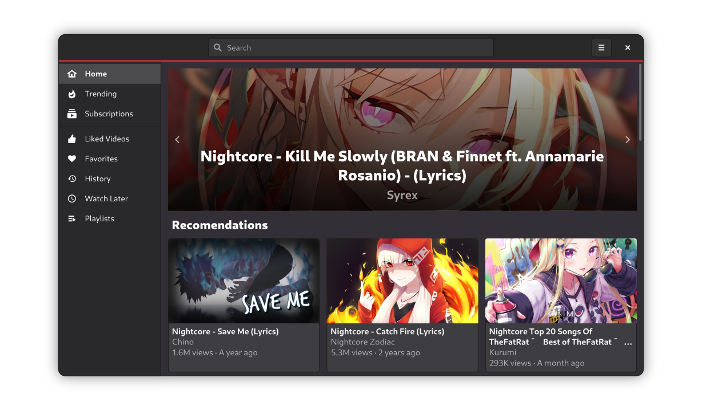

<h1 align="center">
    
     
    Replay
</h1>

    An open source YouTube client for GNOME

    
    
    
    

> **IMPORTANT:** This project is Work in Progress (WIP). It's still on early stages of development and not yet ready for daily use.

Replay is a brand new app for GNOME, designed to be a faster and bulletproof YouTube client for laptops (and phones in the future). You would be able to manage all your subscriptions and playlists, search for videos and explore the new trendings for your location.

## Install

### Stable

Since this project is still under active development, there's no current stable build. You'll see a Flathub badge here when there's one.

### Development

Development builds are automatically generated every time a new change lands on the `master` branch, and are marked with a custom icon and style. You can install a development build simply by going to the [actions](https://github.com/nahuelwexd/Replay/actions) tab of this repository, and downloading one of those that have been successfully generated.

> **NOTE:** You must download the artifact called "Flatpak Bundles", which contains 2 flatpak files ready to install: the application and the locales.

## Contributing

You can read our contributing guidelines [here](CONTRIBUTING.md).

## License

This project is licensed under the [GNU General Public License v3](COPYING) or any later version.

[tl;dr](https://www.tldrlegal.com/l/gpl-3.0): You may copy, distribute and modify this app as long as you track changes/dates in source files. Any modifications to GPL-licensed code must also be available under the GPL along with build & install instructions.
