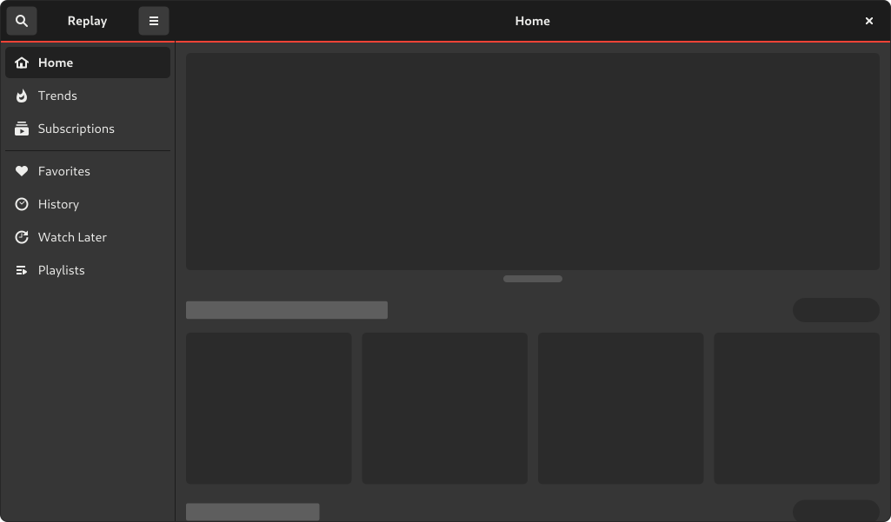
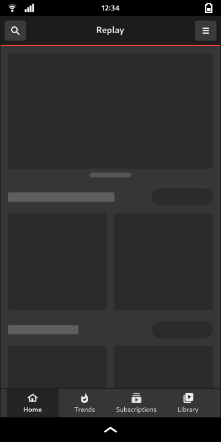
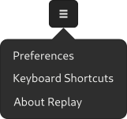

# Main Window

## Desktop View

| Mockup | Description |
| ------ | ----------- |
|  | It will have a navigation sidebar that will allow the user to quickly access each of the different sections of the app, as well as perform searches. It will be dynamically hidden every time the user enters to watch a video, showing on demand, and will return to be permanently visible when the user leaves the video. |

## Mobile View

| Mockup | Description |
| ------ | ----------- |
|  | On mobile, the sidebar will be permanently hidden, and in its place a bottom navigation bar will appear, which will have only a limited number of elements (due to the reduced space), and will delegate the rest to a dedicated view called "Library". This bar will also be dynamically hidden when the user enters videos or searches, but it will not be displayed on demand. |

## Primary Menu

| Mockup | Description |
| ------ | ----------- |
|  | The primary menu of the application will have options to access preferences, keyboard shortcuts, and information about the application quickly and comfortably. Each option will have an associated mnemonic. |
